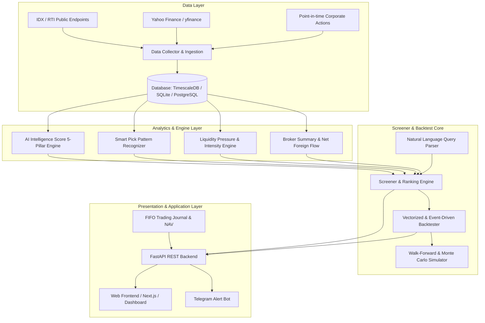

# IHSG Slayer - Platform Architecture & Design Charter

## 1. Overview
**IHSG Slayer** adalah platform analisis pasar saham kuantitatif hybrid untuk Bursa Efek Indonesia (IDX) yang menggabungkan:
1. **Deep Order-Flow & Microstructure Analysis**:
   - Cumulative Volume Delta (CVD) & Liquidity Pressure Model (LPM).
   - Volume Intensity Spike & Volume Rotation (Absorption Efficiency).
   - Broker Aggregation & Net Foreign Flow Tracker.
2. **Multi-Factor AI Fundamental & Technical Scoring**:
   - 5-Pillar Score (Profitability, Valuation, Health, Liquidity, Momentum).
   - Sector-Relative Normalization & Danger Zone Filtering.
3. **Smart Pick Pattern Engine**:
   - 5 Automated Algorithmic Patterns (Area Demand, Throwback/Retest, Liquidity Sweep, Bull Divergence, Early Breakout).
4. **Institutional-Grade Backtesting & Forward Testing Framework**:
   - Point-in-time database, Rank IC, Decile Spreads, Monte Carlo perm tests.
5. **Trading Journal & Notifications**:
   - FIFO NAV-based position tracking, automated risk analytics, Telegram alerts.

---

## 2. High-Level System Architecture

---

## 3. Core Engine Components

### 3.1 Data Pipeline (`src/data`)
- **Multi-source ingest**: Resilient adapter with fallback to cached synthetic and offline data when external APIs are rate-limited.
- **Corporate Action Adjustment**: Splits, reverse splits, rights issues, and cash dividends are adjusted historically for price series while preserving unadjusted raw prices for point-in-time valuation metrics.
- **Point-in-Time Fundamental Snapshots**: Financial reporting dates are strictly aligned with disclosure timestamps to eliminate look-ahead bias in backtesting.

### 3.2 Quantitative Analytics (`src/analytics`)
- **AI Score Engine**: Normalizes financial ratios ($ROE, NPM, ROA, PER, PBV, DER, ADTV, Mom$) against sector peers using percentile ranking and computes a composite $0-100$ score with hard Danger Zone caps.
- **Pattern Recognizer**: Deterministic geometric and volume pattern matching for 5 institutional setup patterns.
- **Liquidity Pressure Model (LPM)**: Signed volume delta accumulation with exponential time-decay to detect institutional accumulation/distribution ahead of price breakouts.
- **Broker & Foreign Tracker**: Top 1/3/5 buyer-seller concentration ratios and institutional net buying flow.

### 3.3 Screener & NL Parser (`src/screener`)
- Flexible filtering supporting composite conditions (e.g. `ai_score >= 70 AND pattern == 'AREA_DEMAND' AND net_foreign > 0`).
- Natural language query parser converting colloquial phrases (e.g. "saham banking undervalue asing akumulasi") into structured queries.

### 3.4 Backtester & Risk Suite (`src/backtest`)
- Multi-regime walk-forward testing.
- Indonesian market transaction cost model (0.15% buy commission, 0.25% sell commission including 0.1% final tax, plus volume-based market impact slippage).
- Quant metrics: Rank IC, Decile Spreads, Sharpe Ratio, Sortino Ratio, Calmar Ratio, Max Drawdown, Win Rate, Profit Factor.
